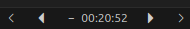

En cette fin 2025, je prends enfin le temps de partager mon experience sur la création de mon extension VS Code, publiée en 2019. À l’époque, juste apres la premiere release, j’avais reçu un avis qui m’a marqué : celui d’un certain **Spencer Williams**.

<u>Ref:</u> https://marketplace.visualstudio.com/items?itemName=sirkane.vscode-mediaplayer&ssr=false#review-details 

Ce message m’a fait plaisir parce qu’au-delà des lenteurs et des mqnquement qu’il soulignait, j'ai senti que l'auteur a du bien comprendre la recherche, l'assemblage des techno (node-mpv, youtube-dl, l'api de vscode, ...) pour finir à lancer un audio depuis VS Code. Je ne m’y attendais pas.

Alors oui, je sais qu’il y a le débat éternel sur les IDE qui en font trop. Personnellement, écouter des podcasts ou de la musique pendant que je code me déconcentre très vite. Je préfère le calme.

Mais cette extension, c'etait simplement un de mes 4899954 side-projects pour experimenter des technos et parce que je fais beaucoup de veille technologique.

Et au final, ça a servit à des gens vu le nombre de telechargments qui est aujourd'hui a 7483 mais aussi [plusieurs issues ouvets sur le repo Github](https://github.com/sir-kain/vscode-mediaplayer/issues?q=is%3Aissue).

## Comment j'ai eu l'idee

C’est venu de plusieurs choses:

- D’abord, je suis tombé sur cette [vidéo](https://www.youtube.com/watch?v=ilcWOQveNKY) de la chaine **Devoxx France** sûrement une recommandation YouTube: Là, j’ai su que l’[API de VS Code](https://code.visualstudio.com/api) était ouverte à la communauté, et en plus avec du NodeJS que je connais bien. J'ai commencé a me demander sur quelle idée devrais-je me lancer.

- Plus tard, j’ai découvert [node-mpv](https://www.npmjs.com/package/node-mpv), un package npm permettant de contrôler en mode headless le lecteur [MPV](https://mpv.io/) que j'utilise physiquement sur mon Ubuntu qui est ultra leger et compatible avec Windows et Mac.

C’est à ce moment-là que j’ai senti que j’avais tous les moyens pour tenter de faire un lecteur audio integré dans VS Code.

## La conception

J'ai commencé par le plus simple : lancer le premier audio (**Make it works first**).

J'ai donc tout codé directement dans la fonction `activate()` du fichier `extension.ts` (l'entrypoint de l'extension): avec l'utilisation du package `node-mpv` et une url d'un audio de test. Et ça a marché. Quand le premier son est sorti depuis VSCode, j'ai eu ma 1ere victoire.
(voir [le commit initial sur GitHub](https://github.com/sir-kain/vscode-mediaplayer/commit/a6227f6e6deac66236b443a4fc1d0e6ccd9e8ac4))

Une fois ce premier test validé, la suite logique était d’intégrer des providers: [Listen Notes](https://www.listennotes.com) pour les podcasts et Youtube.

Il fallait donc mettre en place les vraies fonctionnalites d'un lecteur, j'ai alors entamé un petit benchmarking pour trouver une architecture adaptée aux extensions VS Code.

C'est en explorant le code de l'extension **Peacock** de [John Papa](https://github.com/johnpapa) un developer advocate bien connu dans les communautés Angular et VS Code que j'ai eu le déclic.

J’ai beaucoup apprécié son approche : architecture claire, code lisible, utilisation propre de TypeScript, bundling avec Webpack… exactement ce qu’il me fallait pour passer d’un prototype à une base de code maintenable.

Je me suis donc inspiré de ce projet pour structurer correctement l’extension pour finalement implémenter les fonctionnalités suivantes :

- Recherche sur YouTube et Listen Notes

- Import de fichiers locaux (mp3, mp4, avi, mkv, webm)
- Gestion de playlists (locale, recherche, favoris)

- Contrôles : play, pause, next, prev, sauts ±20s

- Affichage des détails de track
- Système de favoris

---

Si vous souhaitez explorer le code ou tester l'extension :

- [GitHub Repository](http://github.com/sir-kain/vscode-mediaplayer)
- [VS Code Marketplace](https://marketplace.visualstudio.com/items?itemName=sirkane.vscode-mediaplayer)
